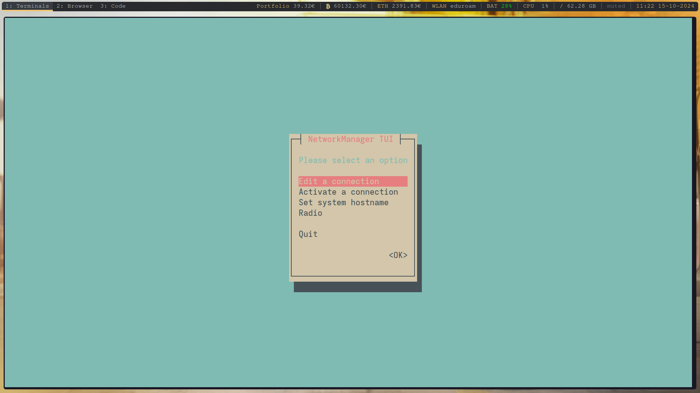
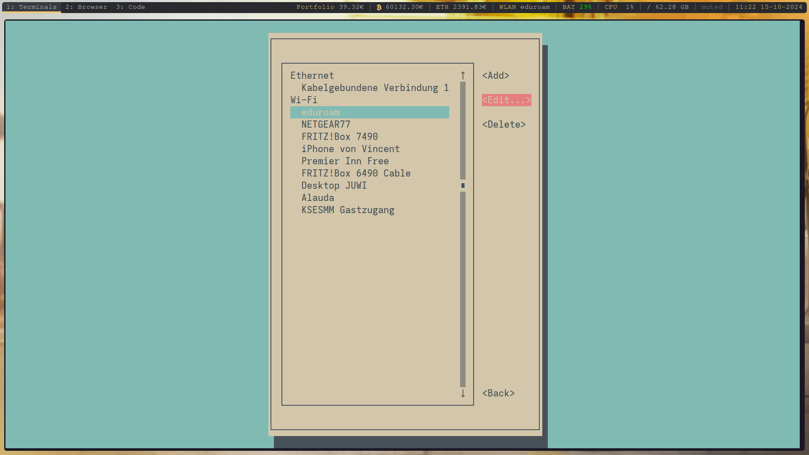
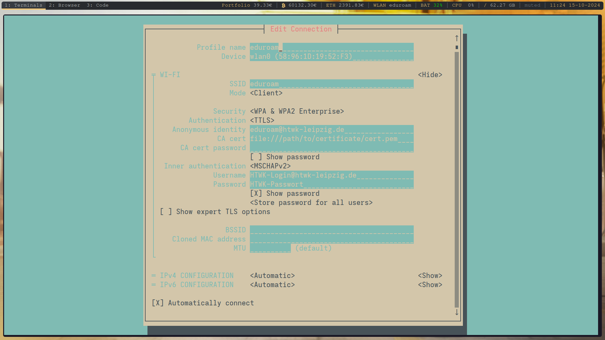

# Anleitungen für Dienste der HTWK Leipzig

Da manche Anleitungen auf der Seite des ITSZ veraltet sind bzw. für Linux vielleicht nicht funktionieren, gibt es hier aktuelle Anleitungen. Primär handelt es sich dabei um das WLAN (Eduroam) und den VPN. Für die Einrichtung wird eine Internetverbindung vorausgesetzt, um das Zertifikat zu installieren.

## Einrichtung Eduroam für Androidgeräte

### Zertifikat installieren

Zuerst laden Sie das [Zertifikat](T-TeleSec_GlobalRoot_Class_2.crt) runter und installieren es. 

**Android 14**:  
WLAN-Einstellungen -> Zertifikat installieren -> T-TeleSec... Zertifikat auswählen und Namen vergeben.

**Android 13**:  
WLAN-Einstellungen -> Drei Punkte oben rechts -> Erweiterte Einstellungen -> Zertifikat hinzufügen ->  T-TeleSec... Zertifikat auswählen und Namen vergeben.

### Mit Eduroam verbinden

Wählen Sie Eduroam aus und geben Sie folgende erweiterten Einstellungen ein:  

   - EAP-Methode: PEAP
   - Phase-2-Authentifizierung: MS-CHAP v2
   - CA-Zertifikat: Zertifikat mit vorher festgelegtem Namen auswählen
   - TLS: TLS v1.0 / TLS-SSL
   - Online-Zertifikatstatus: Nicht prüfen
   - Domain: radius.rz.htwk-leipzig.de
   - Identität: **HTWK-Login**@htwk-leipzig.de
   - Anonyme Identität: eduroam@htwk-leipzig.de
   - Passwort: **HTWK-Passwort**
   - Verbinden drücken  

Es funktioniert (hoffentlich).

## Einrichtung Eduroam für iOS/iPadOS/MacOS/Windows

Die Anleitungen dafür sind noch aktuell. Um zu den Anleitungen zu gelangen bitte auf das zutreffende Betriebssystem klicken.  

[iOS](https://itsz.htwk-leipzig.de/dienste/wlan/einrichtung-unter-macos/einrichtung-unter-ios-ipad/einrichtung-auf-dem-iphone)  
[iPadOS](https://itsz.htwk-leipzig.de/dienste/wlan/einrichtung-unter-macos/einrichtung-unter-ios-ipad)  
[MacOS](https://itsz.htwk-leipzig.de/dienste/wlan/einrichtung-unter-macos/einrichtung-unter-ios-ipad/einrichtung-auf-dem-iphone/einrichtung-unter-macos)  
[Windows](https://itsz.htwk-leipzig.de/dienste/wlan/einrichtung-unter-windows) 

## Einrichtung Eduraom für Linux

Hierfür gibt es zwei Möglichkeiten. Zum einen kann man den [Installer](https://cat.eduroam.org/?idp=5142) herunterladen und der [Anleitung](https://itsz.htwk-leipzig.de/dienste/wlan/einrichtung-unter-linux) folgen. Sollte dieser nicht funktionieren, da er Fehler auswirft, kann man die Daten auch per Hand eintragen. In der Anleitung wird dafür das Tool `nmtui` benutzt. Das ist das Terminal User Interface des [NetworkManagers](https://wiki.archlinux.org/title/NetworkManager). 

### Anleitung sofern Installer nicht funktioniert

1. [Zertifikat](T-TeleSec_GlobalRoot_Class_2.crt) herunterladen
2. `nmtui` im Terminal öffnen
    
3. *Eine Verbindung bearbeiten* wählen und **Eduroam** auswählen
    
4. Folgendes eintragen:
    
5. Einstellungen speichern. Das Gerät sollte sich eigenständig mit Eduraom verbinden.

Es funktioniert (hoffentlich).

## Einrichtung VPN für Android-/iOS-/Windows-/Linuxgeräte

**Wichtiger Hinweis**

Beim erstmaligen Herstellen einer Verbindung (oder bei neuem Zertifikat auf dem VPN Server) wird Ihnen ein Fingerprint angezeigt (nicht in vorkonfigurierten Installationspaketen für Windows). Bitte überprüfen Sie diesen.  
Windows: Der korrekte "Fingerprint" lautet: "SEEK TWIN VINE EDNA SELF AREA ABET CUB BOWL BECK SAIL DEFT"  
Linux und MacOS: Der korrekte "Root CA fingerprint" lautet: "NEAR FEE GASH SHOT THY THAT ATOM NINE SEEK OBEY LIEN BLOW"

### Anleitung für Android-/iOS-/Windowsgeräte

Für die Einrichtung des VPNs dürfen Sie nicht mit dem Hochschulnetz (Eduroam) verbunden sein. Anleitungen sind hier zu finden:  
[Android](https://itsz.htwk-leipzig.de/dienste/vpn-zugriff-auf-das-hochschulnetz/android-chromeos)  
[iOS](https://itsz.htwk-leipzig.de/dienste/vpn-zugriff-auf-das-hochschulnetz/ios)  
[Windows](https://itsz.htwk-leipzig.de/dienste/vpn-zugriff-auf-das-hochschulnetz/windows-10) *Anmelden* auf der Seite, um den Client herunterzuladen.  

## Einrichtung für Linux

Es gibt eine [Anleitung](https://itsz.htwk-leipzig.de/dienste/vpn-zugriff-auf-das-hochschulnetz/linux) (*Anmelden* für Client) auf der Seite des ITSZ, wenn diese nicht funktioniert, gibt es hier eine alternative Anleitung.

### Anleitung für Linux

kommt noch
